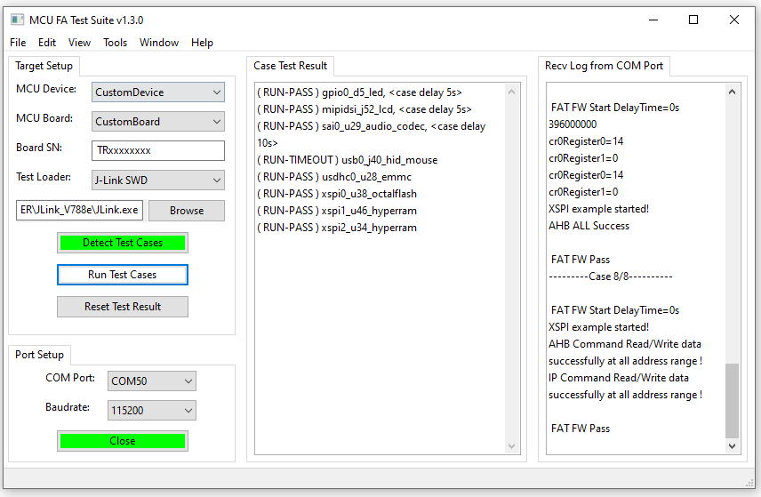

# MCU-FATestSuite
A flexible FAT tool based on Python2.7+wxPython4.0, it can do flexible FA tests for NXP MCU (i.MXRT...) | 恩智浦MCU板卡出厂验收测试(FAT)一站式工具 



### 1. 使用步骤
```text
1. 打开 MCU-FATestSuite 软件
2. 点击 'Browse' 设置正确的 JLINK.exe 路径
3. 将所有测试程序(.srec格式)放置在 \src\targets\MIMXRT798\FOWLP324-EVK_Rev.A\ 目录下
  - 程序需编译在 MCU 内部 RAM 运行
  - 程序不可含任何启动头（BOOT_HEADER_ENABLE=0），起始部分即为中断向量表
  - 程序开始需打印输出 PRINTF("\r\n FAT FW Start\r\n");
  - 程序结束需打印输出 PRINTF("\r\n FAT FW Pass\r\n"); 或者 PRINTF("\r\n FAT FW Fail\r\n");
  - 程序结束如需额外延时可打印输出 PRINTF("\r\n FAT FW Start DelayTime=10s\r\n");
4. 点击 'Detect Test Cases' 按钮扫描测试程序
 
板卡上电 / 换新一块板卡
5. 点击 'Reset Test Result' 按钮
6. 点击 'Open' 按钮打开串口（确保串口号与板卡对应），确保状态变为 'Close'
7. 点击 'Run Test Cases' 按钮开始跑，按钮黄色说明正在跑
 
重复 5、6、7
```

### 2. 用户配置项

```Python
# 连接 J-Link 时的配置
jlinkDevice     = 'MIMXRT798S_M33_0'
jlinkInterface  = 'SWD'
jlinkSpeedInkHz = 4000

# 程序中串口数据刷新间隔（thread进程重入时间）
uartRecvInterval = 0.5  # seconds

# 测试程序APP与工具接头字符
fatLogStart = 'FAT FW Start'
fatLogPass  = 'FAT FW Pass'
fatLogFail  = 'FAT FW Fail'
fatLogDelay = ' DelayTime='

# 从调用 J-Link 加载程序开始到接收到 fatLogStart 的最大等待时间
loadAppTimeout    = 5.0  # seconds
# loadAppTimeout 时间内未收到 fatLogStart，重复调用 J-Link 加载程序次数，失败返回 LOAD-FAIL 测试结果
loadAppRetryCount = 3

# 从接收到 fatLogStart 开始到接收到 fatLogPass/fatLogFail 的最大等待时间，超时可返回 RUN-TIMEOUT 测试结果
waitAppTimeout    = 10.0 # seconds
```
